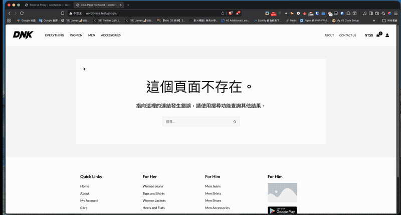

# WP Reverse Proxy

**繁體中文** | [English](README.en.md)


[](https://codecov.io/gh/recca0120/wp-reverse-proxy)


一個 WordPress 外掛，可將特定 URL 路徑代理到外部後端伺服器。

## 功能特色

- 路由匹配支援萬用字元 (`/api/*`) 與前綴匹配 (`/api`)
- HTTP 方法匹配 (`POST /api/users`, `GET|POST /api/*`)
- Nginx 風格的路徑前綴移除（目標 URL 以 `/` 結尾）
- 完整 HTTP 方法支援 (GET, POST, PUT, PATCH, DELETE)
- 請求/回應標頭轉發
- 中介層支援請求/回應處理
- WordPress 後台管理介面（視覺化路由設定）

## 快速預覽



## 系統需求

- PHP 7.2+
- WordPress 5.0+

## 安裝

### 從 GitHub Releases 下載（推薦）

1. 前往 [Releases 頁面](https://github.com/recca0120/wp-reverse-proxy/releases)
2. 下載 **`reverse-proxy.zip`**
3. 在 WordPress 後台 → 外掛 → 安裝外掛 → 上傳外掛
4. 上傳 zip 檔案並啟用

### 透過 Composer

```bash
composer require recca0120/wp-reverse-proxy
```

## 快速開始

啟用外掛後，前往 **WordPress 後台 → 設定 → Reverse Proxy** 即可開始設定路由。

進階用戶可使用配置檔或 PHP Filter Hook，詳見 [配置參考](docs/zh/configuration.md)。

## 文件

| 文件 | 說明 |
|------|------|
| [配置參考](docs/zh/configuration.md) | 路由配置格式、路徑匹配規則 |
| [中介層參考](docs/zh/middlewares.md) | 所有內建中介層的用法與自訂中介層 |
| [Hooks 參考](docs/zh/hooks.md) | WordPress Filters 和 Actions |
| [開發指南](docs/zh/development.md) | 開發環境設定、測試 |

## 內建中介層

| 中介層 | 說明 |
|--------|------|
| `ProxyHeaders` | 新增 X-Forwarded-* 標頭 |
| `SetHost` | 設定自訂 Host 標頭 |
| `RewritePath` | 重寫請求路徑 |
| `RewriteBody` | 重寫回應內容 |
| `AllowMethods` | 限制 HTTP 方法 |
| `Cors` | 處理 CORS |
| `IpFilter` | IP 白名單/黑名單 |
| `RateLimiting` | 請求限流 |
| `Caching` | 回應快取 |
| `Timeout` | 請求超時控制 |
| `Retry` | 失敗自動重試 |
| `CircuitBreaker` | 熔斷器模式 |
| `Fallback` | 回退給 WordPress 處理 |

詳細用法請參考 [中介層參考](docs/zh/middlewares.md)。

## 獨立使用（不依賴 WordPress）

這個套件的核心元件可以獨立於 WordPress 使用，適用於任何 PHP 專案。

### 安裝

```bash
composer require recca0120/wp-reverse-proxy
```

### 基本用法

```php
<?php

use Recca0120\ReverseProxy\ReverseProxy;
use Recca0120\ReverseProxy\Routing\Route;
use Recca0120\ReverseProxy\Routing\RouteCollection;

// 建立路由集合
$routes = new RouteCollection();
$routes->add(new Route('/api/*', 'https://api.example.com/'));
$routes->add(new Route('GET /users/*', 'https://users.example.com/'));

// 建立 Reverse Proxy 並處理請求
$proxy = new ReverseProxy($routes);
$response = $proxy->handle();  // 自動從 $_SERVER 建立請求

if ($response !== null) {
    // 發送回應
    http_response_code($response->getStatusCode());
    foreach ($response->getHeaders() as $name => $values) {
        foreach ($values as $value) {
            header("{$name}: {$value}", false);
        }
    }
    echo $response->getBody();
} else {
    // 沒有匹配的路由，處理 404 或其他邏輯
    http_response_code(404);
    echo 'Not Found';
}
```

### 自訂 HTTP Client

預設使用 `CurlClient`，參數為 `['verify' => false, 'decode_content' => false]`。
如需自訂：

```php
use Recca0120\ReverseProxy\Http\CurlClient;

$httpClient = new CurlClient([
    'verify' => true,           // 啟用 SSL 驗證（預設 false）
    'timeout' => 30,            // 超時秒數
    'decode_content' => true,   // 自動解碼 gzip/deflate（預設 false）
]);

$proxy = new ReverseProxy($routes, $httpClient);
```

### 使用中介層

```php
use Recca0120\ReverseProxy\Routing\MiddlewareManager;
use Recca0120\ReverseProxy\Middleware\Cors;
use Recca0120\ReverseProxy\Middleware\RateLimiting;
use Recca0120\ReverseProxy\Middleware\ProxyHeaders;

// 建立中介層管理器
$middlewareManager = new MiddlewareManager();

// 註冊全域中介層（套用到所有路由）
$middlewareManager->registerGlobalMiddleware([
    new ProxyHeaders(),
]);

// 建立路由集合，傳入中介層管理器
$routes = new RouteCollection([], $middlewareManager);

// 新增帶有中介層的路由
$routes->add(new Route('/api/*', 'https://api.example.com/', [
    new Cors(['*']),
    new RateLimiting(100, 60),  // 每分鐘 100 次請求
]));
```

### 使用快取

```php
use Psr\SimpleCache\CacheInterface;
use Recca0120\ReverseProxy\Routing\MiddlewareManager;
use Recca0120\ReverseProxy\Routing\RouteCollection;

// 實作 PSR-16 CacheInterface 或使用現有套件
// 例如：symfony/cache, phpfastcache 等
$cache = new YourCacheImplementation();

// 中介層管理器可注入快取（供 RateLimiting、CircuitBreaker 等使用）
$middlewareManager = new MiddlewareManager($cache);

// 路由集合也可使用快取（快取路由配置）
$routes = new RouteCollection([], $middlewareManager, $cache);
```

### 使用設定檔載入路由

```php
use Recca0120\ReverseProxy\Routing\FileLoader;
use Recca0120\ReverseProxy\Routing\MiddlewareManager;
use Recca0120\ReverseProxy\Routing\RouteCollection;

// 從目錄載入 JSON/PHP 設定檔
$loader = new FileLoader(['/path/to/routes']);
$middlewareManager = new MiddlewareManager();

$routes = new RouteCollection([$loader], $middlewareManager);
// 路由會在第一次存取時自動載入（Lazy Loading）
```

**routes.json 範例：**

```json
[
    {
        "path": "/api/*",
        "target": "https://api.example.com/",
        "methods": ["GET", "POST"],
        "middlewares": [
            "Cors",
            ["RateLimiting", 100, 60]
        ]
    }
]
```

## 授權

MIT License - 詳見 [LICENSE](LICENSE)。

## 作者

Recca Tsai - [recca0120@gmail.com](mailto:recca0120@gmail.com)
